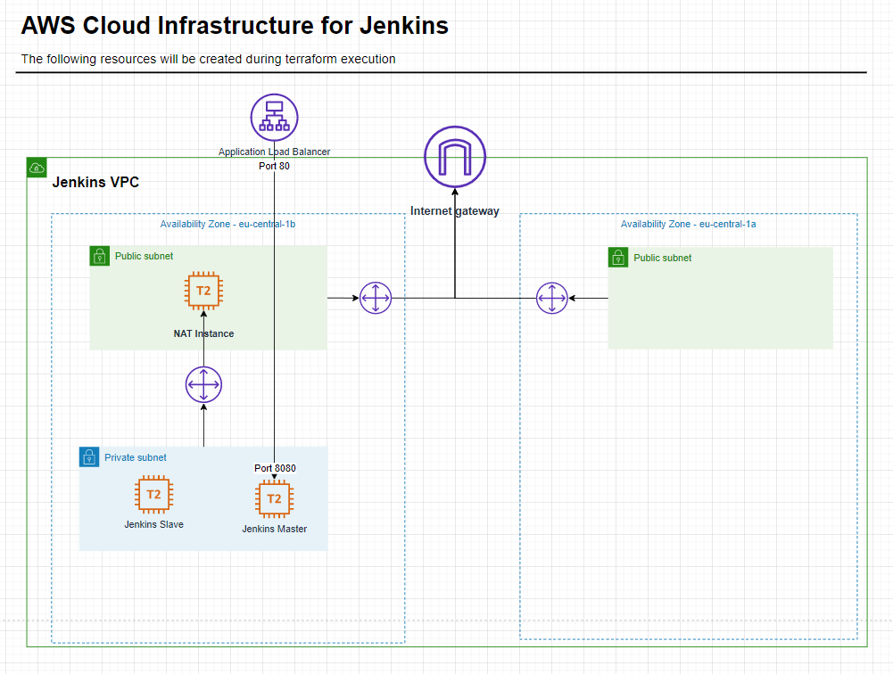

# General
* Default location: Frankfurt (eu-central-1)
* Default availability zone for main resources: "eu-central-1b"
* 1 public subnet will use "eu-central-1a" AZ. (Need to create Application Load Balancer)

The scripts in this repository will create the following resources in AWS Cloud:


## Project structure
* ansible - folder with ansible playbooks, inventories, etc.
* terraform - folder with terraform infrastructure files
* images - pictures used in README
```
|-- ansible
|   |-- roles
|   |   |-- ansible-role-java
|   |   `-- ansible-role-jenkins
|   |-- templates
|   |-- vars
|   `-- tmp
|-- terraform
|-- images
```

# Getting started

## Pre-requisites:
This playbook is written for Linux only with the focus on Ubuntu18.04.

You should have the following software installed on your host
1. terraform
2. ansible
3. python


## Prepare environment
Prepend environment for using ansible dynamic inventory with Amazon ec2:
```
$ pip install boto
$ chmod +x ansible/ec2.py
```
Of course, you'll need to have AWS credentials. By default you can find it in  ~/.aws/credentials
```
$ cat ~/.aws/credentials
[default]
aws_access_key_id = <AWS_ACCESS_TOKEN>
aws_secret_access_key = <AWS_SECRET_ACCESS_KEY>
...
```

## Short execution plan with default parameters usage
```
$ ssh-keygen -m PEM -t rsa -b 2048 -C jenkins@jenkins -f jenkins.pem -N "" -q
$ chmod 600 jenkins.pem
$ mv jenkins.pem.pub jenkins.pub

$ cd terraform
$ terraform init
$ terraform apply -auto-approve

cd ../ansible
ansible-playbook -i ec2.py create_custom_ssh_config.yml
ansible-playbook -i ec2.py linux_jenkins_slave.yml
ansible-playbook -i ec2.py linux_jenkins_installation.yml
```
Now you should be able to connect to Jenkins Server.
Please use Application Load Balancer DNS name, it's appear in terraform output. Or you can find it in your AWS console.

Go though default installation steps and enjoy your new Jenkins CI\CD installation.

## Usage description
### Preparation
Ansible and Terraform scripts will ask you for private and public ssh keys.
In case you have no existed one, follow the instruction below:
```
ssh-keygen -m PEM -t rsa -b 2048 -C jenkins@jenkins -f jenkins.pem -N "" -q
chmod 600 jenkins.pem
mv jenkins.pem.pub jenkins.pub
```

Or set your variables in "terraform/terraform.tfvars" and "ansible/vars/jenkins_vars.yml" files accordingly.
```
public_key_path = "../jenkins.pub"
private_key_path = "../jenkins.pem"
key_pair_name = "jenkins"
```
Please check "terraform/terraform.tfvars", "terraform/variables.tf" and "ansible/vars/jenkins_vars.yml" files. They contain default variables, used in automation.

### Terraform
Go to terraform folder and download all required plugins.
```
$ cd terraform
$ terraform init
```

If your want to see plan of your own infrastructure

```
$ terraform plan
```
OR if you would like to pass variables directly to the script against usage of terraform.tfvars file
```
$ terraform plan -var private_key_path = <path_to_your_private_key> -var public_key_path = <path_to_your_public_key>
```

To create all resources and provision all services
```
$ terraform apply
```
OR
```
$ terraform apply -var private_key_path = <path_to_your_private_key> -var public_key_path = <path_to_your_public_key>
```
Now your resources should be successfully created and available in AWS Console.

To delete all created resources
```
$ terraform destroy
```
OR
```
$ terraform destroy -var private_key_path = <path_to_your_private_key> -var public_key_path = <path_to_your_public_key>
```

### Ansible
Go to ansible folder to configure Jenkins Master and Jenkins Slave hosts.
```
$ cd ansible

```
Generate custom SSH configuration file to be able to work with resources in private subnet. It will use NAT instance as a proxy for connection. Execute:

```
ansible-playbook -i ec2.py create_custom_ssh_config.yml
```

The next step will configure Jenkins Slave host(s).
This playbook will:
* install java and maven packages
* create configuration files for the slaves.

Run the following command, if you use `vars/jenkins_vars.yml`
```
ansible-playbook -i ec2.py linux_jenkins_slave.yml

```
OR insert your variables to command line
```
ansible-playbook -i ec2.py linux_jenkins_slave.yml -u ubuntu --private-key=<path_to_your_private_key> -e "ansible_python_interpreter=/usr/bin/python3" -e "<your_extra_vars>"

```

To install and configure Jenkins Master server, please execute 'linux_jenkins_installation.yml' playbook
```
ansible-playbook -i ec2.py linux_jenkins_installation.yml
```
OR
```
ansible-playbook -i ec2.py linux_jenkins_installation.yml -u ubuntu --private-key=<path_to_your_private_key> -e "ansible_python_interpreter=/usr/bin/python3" -e "<your_extra_vars>"
```

Now you could use your new Jenkins!
Please use Application Load Balancer DNS name, it appears in terraform output. Or you can find it in your AWS console.

Go though default installation steps and enjoy your new Jenkins CI\CD installation!


# Terraform structure
```
terraform
|-- alb.tf         # Application Load Balancer configuration with dependencies
|-- data.tf        # data sources
|-- main.tf        # contain general infrastructure description
|-- output.tf      # contain variables, that will be printed as an output
|-- variables.tf   # define all required variables with description and default values
|-- vpc.tf         # configure custom VPC, 2 public and 1 private subnet, routes, internet gateway and NAT instance

```
### General
Terraform script will create required infrastructure, based on AWS Cloud EC2 instances.
Will create requested amount of hosts for Jenkins Master and Slaves.
At the same time the security group will be configured and assigned for them.

#### Input variables
Terraform scripts get the following variables as an input:
```
"aws_region"
  description: "AWS EC2 Region"
  default value: "eu-central-1"

"aws_key_pair_name"
  description: "Name of key pair that will be generated in AWS for further access to the instances"
  default value: "jenkins"

"public_key_path"
  description: "Path to SSH public key"
  default value: has no default value

"private_key_path"
  description: "Path to the SSH private key"
  default value: has no default value

"ssh_user"
  description: "User used to log in to instance"
  default value: "ubuntu"

"jenkins_slaves_instance_count"
  description: "Count of EC2 instances allocated for Jenkins master"
  default = "1"

"jenkins_slaves_instance_count"
  description: "Count of EC2 instances allocated for Jenkins Slaves"
  default value: "1"

"vpc_cidr"
  description: "CIDR for the whole VPC"
  default value: "10.0.0.0/16"

"public_1_subnet_cidr"
  description: "CIDR for the Public Subnet"
  default value: "10.0.0.0/24"

"public_2_subnet_cidr"
  description: "CIDR for the Public Subnet"
  default value: "10.0.2.0/24"

"private_subnet_cidr"
  description: "CIDR for the Private Subnet"
  default value: "10.0.1.0/24"

"availability_zone"
  description: "Availability zone for all resources"
  default value: "eu-central-1b"

"public_2_subnet_availability_zone"
    description: "Availability zone for all resources"
    default value: "eu-central-1a"

```

#### Output variables

```
"key_pair_name": AWS key pair name

"public_key_path": Path to SSH public key

"private_key_path": Path to SSH private key

"jenkins_master_sg_id": Security group ID applied for Jenkins Master host

"jenkins_slave_sg_id": Security group ID applied for Jenkins Slave hosts

"jenkins_master_private_ip": Private IP address of created Jenkins Master host

"jenkins_master_private_dns": Private DNS names of created Jenkins Master host

"jenkins_slave_private_ip": Private IP addresses of created Jenkins Slave hosts

"jenkins_slave_private_dns": Private DNS names of created Jenkins Slave hosts

"ami_id": ID of EC2 image used for resources

"aws_region": Region used in resource creation

"nat_elastic_ip": IP of NAT instance, used as proxy(bastion) host

"jenkins_master_alb_dns_name": DNS name of ALB, providing access to private Jenkins Master

```

# Ansible structure

```
|-- ansible
|   |-- roles
|   |   |-- ansible-role-java
|   |   `-- ansible-role-jenkins
|   |-- templates
|   |-- vars
```

### General
Ansible directory contain all required stuff to configure Jenkins Master and Slave hosts.

#### playbooks

* Playbook: linux_jenkins_slave.yml
  * Install:
    - package updates
    - java (default: java11)
    - maven
  * Generate slave host configuration file from template `templates/jenkins-slave.xml.j2`

* Playbook: `linux_jenkins_installation.yml` includes:
  * Install:
    - package updates
    - java (default: java11)
    - jenkins (default: stable)

  * Configure:
    - pipeline job
    - slave hosts

#### inventory
In this configuration is used dynamic inventory script ec2.py, which takes information from AWS Cloud.
Please find more information https://docs.ansible.com/ansible/latest/user_guide/intro_dynamic_inventory.html#inventory-script-example-aws-ec2

#### roles/ - directory with roles used in the playbooks
* ansible-role-java. Find more information here: "https://github.com/geerlingguy/ansible-role-java"

* ansible-role-jenkins. Find more information here: "https://github.com/geerlingguy/ansible-role-jenkins"

#### vars/ - variables used for playbooks
Variable used in Ansible script:
```
# Default user for ssh connection during playbook execution. Used "ubuntu" value, because instances run on Ubuntu18.04 image
ansible_ssh_user: "ubuntu"

# SSH public and private key paths. Used for connection and for some templates
public_key_path: "../jenkins-master.pub"
private_key_path: "../jenkins-master.pem"
# SSH public and private keys values uploaded to specific variable. Used in templates.
public_key: "{{ lookup('file', '{{ public_key_path }}' )}}"
private_key: "{{ lookup('file', '{{ private_key_path }}' )}}"

# Variables used for Jenkins Master and Jenkins Slaves configuration
jenkins_admin_username: admin
jenkins_admin_password: admin
jenkins_hostname: "{{ ec2_public_dns_name }}"
jenkins_http_port: 8080
jenkins_jar_location: /opt/jenkins-cli.jar
jenkins_slave_packages:
  - maven

# Variables for jenkins-slave.xml.j2
# Number of executors for each slave host
num_executors: 1
# Default label for slaves
jenkins_slave_label: "jenkins-slave"
# SSH port for connection to slave
ssh_port: 22
# Credential ID used for connection to slave
credentials_id: "ubuntu"

# Variables for job_config.xml.j2
# Git repository with source code
git_repo: "https://github.com/sorokina-ea/simple-java-maven-app.git"
# Default branch
default_branch: master
# Job will be created with this name
jenkins_job_name: "maven-project-pipeline"

```
Please find more information about role variables:
* Role: ansible-role-java following path "ansible/roles/ansible-role-java/README.md" or "https://github.com/geerlingguy/ansible-role-java"
* Role: ansible-role-jenkins following path "ansible/roles/ansible-role-jenkins/README.md" or "https://github.com/geerlingguy/ansible-role-jenkins"

#### templates/ - template files used for Jenkins slave nodes, jobs, etc.

```
|   |-- templates
|   |   |-- credentials.xml.j2                     # Template for credentials generation wiht SSH key
|   |   |-- jenkins-slave.xml.j2                   # Template for Jenkins slaves configuration
|   |   |-- job_config.xml.j2                      # Template for job configuration wiht pipeline
|   |   `-- custom_ssh.cfg.j2                      # Template for custom SSH config
```
